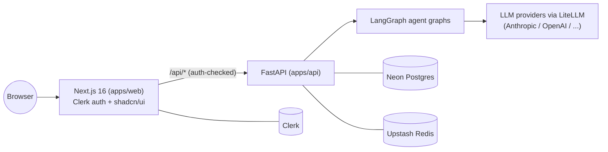

# AI Agents Workforce

A shared platform ("kernel") for shipping production-grade AI agents, one at a time. Every agent is a module built on top of the same auth, database, memory, and orchestration layer instead of a one-off throwaway demo.

Built as a portfolio + freelance product line: each agent ships polished, deployed, and documented well enough to (a) show a recruiter and (b) sell to a client.

## Architecture



- **Frontend**: Next.js 16 (App Router, Turbopack), TypeScript, Tailwind, shadcn/ui (Base UI), Clerk for auth. Deployed on Vercel.
- **API layer**: FastAPI. Verifies the caller is authenticated, then proxies to the agent backend and streams the response back over SSE.
- **Agent orchestration**: LangGraph. Every agent is a compiled graph; this repo's first agent (`echo`) is a one-node walking-skeleton graph proving the plumbing works end to end.
- **LLM access**: LiteLLM as the provider gateway, so agents aren't hard-wired to one vendor.
- **Data**: Neon Postgres (serverless) for persistent state, Upstash Redis for memory/cache/rate-limiting.
- **Auth**: Clerk, provisioned via the Vercel Marketplace, protecting both pages (`proxy.ts`) and API routes.

## Repo structure

```
apps/
  web/    Next.js frontend (dashboard, auth, chat UI)
  api/    FastAPI + LangGraph backend
infra/
  docker-compose.yml   local Postgres/Redis + api, for dev without cloud accounts
docs/
```

Future agents (RAG support bot, voice receptionist, SDR, insurance claims, multi-agent orchestrator) land as new graphs under `apps/api/app/agents/` and new routed pages under `apps/web/src/app/`, reusing this same kernel rather than starting a new repo each time.

## Local development

**Frontend** (`apps/web`):
```bash
npm install
vercel env pull .env.local   # or copy .env.example and fill in manually
npm run dev
```

**Backend** (`apps/api`):
```bash
python -m venv .venv
.venv/Scripts/pip install -r requirements.txt   # .venv/bin/pip on macOS/Linux
cp .env.example .env   # fill in DATABASE_URL / REDIS_URL / an LLM key
.venv/Scripts/python -m uvicorn app.main:app --reload --port 8000
```

Without an `ANTHROPIC_API_KEY` or `OPENAI_API_KEY` set, the demo agent streams a canned explanation instead of a real model response — the graph, SSE plumbing, and auth all still work, so you can verify the whole stack before paying for a single token.

Prefer containers? `docker compose -f infra/docker-compose.yml up` runs Postgres + Redis + the API locally, no cloud accounts required (the frontend still needs its own Clerk/Vercel setup for auth).

## Status

- [x] Auth (Clerk) wired into pages and API routes, enforced in `proxy.ts`
- [x] Postgres (Neon) and Redis (Upstash) provisioned and connected
- [x] FastAPI + LangGraph backend with a real streamed SSE agent response
- [x] Next.js chat UI consuming the stream end to end (verified in-browser, not just compiled)
- [ ] CI/CD (GitHub Actions)
- [ ] Deployed to production (Vercel + Railway)
- [ ] First real agent (Customer Support RAG)

## Roadmap (full-time pace, ~8-9h/day)

This is the honest version, not the marketing version. At sustained full-time effort the platform-plus-five-agents portfolio compresses from ~8-9 months (part-time) to roughly **10-11 weeks**. That pace is genuinely aggressive — there's no slack in it for the inevitable surprise (a flaky third-party API, a broken SDK upgrade like the Base UI `asChild` change we hit on day one). Treat the weekly boundaries as targets, not guarantees.

| Weeks | Deliverable | Why this one, why now |
|---|---|---|
| 1 | Finish the kernel: CI/CD, Docker verified, deploy to Vercel + Railway, tests skeleton | Nothing else ships until the platform itself is live |
| 2 | **Customer Support RAG agent** — PDF ingestion, hybrid search + rerank, citations, escalation, feedback loop | Table stakes; proves RAG competence; first sellable Upwork/Fiverr template |
| 3-4 | **Voice Receptionist + missed-call text-back** — Twilio, Deepgram STT, Calendar booking, SMS confirmation | Highest-$ freelance category right now (SMB clinics/salons/contractors pay $99-299/mo for this today) |
| 5-6 | **AI SDR / Lead-Gen agent** — research, scoring, personalized outreach, HubSpot sync, CSV export | Real B2B budget line; demonstrates multi-step agent chains, not just chat |
| 7-8 | **Insurance Claims Intake & Triage** (flagship) — OCR, fraud scoring, policy lookup, mandatory human-in-loop approval | The one project nobody else's portfolio has; grounded in real domain expertise, not generic |
| 9-10 | **Multi-agent orchestration** — wire Reception -> Sales -> CRM -> Calendar -> Analytics through a LangGraph supervisor | Built from parts already shipped, not from scratch; this is the flagship recruiters remember |
| 11 | Polish pass: Langfuse + Sentry across every repo, architecture diagrams, README pass, portfolio site, all demo videos | Unfinished polish is what makes a portfolio look unfinished |

## License

MIT
