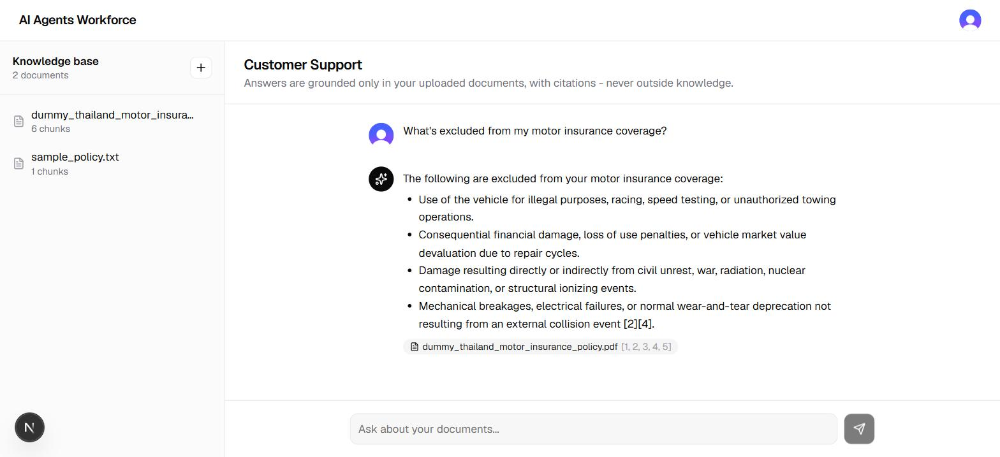
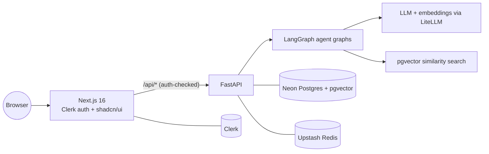
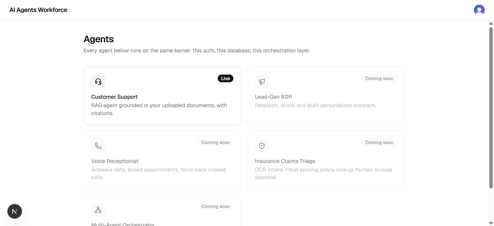

<div align="center">

# AI Agents Workforce

**A shared platform for shipping production-grade AI agents — one at a time.**

Auth, database, streaming, and orchestration are built once as a kernel. Every agent is a module on top of it, not a one-off throwaway demo.

[](https://nextjs.org)
[](https://fastapi.tiangolo.com)
[](https://www.langchain.com/langgraph)
[](https://vercel.com)
[](#license)

[**Live demo**](https://web-rose-omega-72.vercel.app) &nbsp;·&nbsp; [Customer Support agent](https://web-rose-omega-72.vercel.app/dashboard/support) &nbsp;·&nbsp; [API health](https://api-indol-nu-61.vercel.app/health)

</div>

<br/>



## What this is

A portfolio of AI agents that solve real business problems — customer support, lead generation, appointment booking, voice reception, insurance intake — all built on one shared platform instead of scattered one-off scripts. Every agent gets the same authentication, database, streaming pipeline, and LangGraph orchestration, so adding a new one is an afternoon of agent-specific work, not another few days of re-plumbing auth and infra.

The first agent live today is a **Customer Support RAG agent**: upload a document, ask a question, get an answer grounded only in what you uploaded — with inline citations, never a hallucinated guess.

## Features

- **Real retrieval-augmented generation** — PDF/text upload → chunking → OpenAI embeddings → pgvector similarity search → cited, streamed answers
- **Token-level streaming** end to end, from the LangGraph node through FastAPI (SSE) through Next.js to the browser
- **Authenticated by default** — every page and API route is protected via Clerk, enforced in Next.js Proxy middleware, not left to convention
- **One kernel, many agents** — an agent hub at `/dashboard` where each new agent is a card and a route, sharing the same auth/DB/orchestration layer
- **Deployed, not just demoed** — both the frontend and the Python backend run as real Vercel Functions in production, verified with actual sign-ups and real documents, not just a passing build

## Tech stack

| Layer | Choice | Why |
|---|---|---|
| Frontend | Next.js 16 (App Router), TypeScript, Tailwind, shadcn/ui | Modern React stack, fast to ship, deploys natively on Vercel |
| Backend | FastAPI (Python) | Async-native, typed, the natural home for the AI/ML ecosystem |
| Agent orchestration | LangGraph | Stateful, streamable, production-oriented multi-step agent graphs |
| LLM access | LiteLLM | One interface across providers (OpenAI today, others without a rewrite) |
| Vector search | Postgres + `pgvector` (HNSW index) | No separate vector DB to run or pay for at this scale |
| Database | Neon (serverless Postgres) | Branching, autoscaling, zero server to manage |
| Memory / cache | Upstash Redis | Serverless, pay-per-use |
| Auth | Clerk | Drop-in auth with first-class Next.js middleware support |
| Hosting | Vercel (Fluid Compute, both apps) | One platform for the Next.js frontend and the Python backend — SSE streaming, WebSockets, and long timeouts all work natively |

## Architecture



Every agent is a compiled LangGraph graph living in `apps/api/app/agents/`. The Customer Support agent, for example, is a two-node `retrieve -> generate` graph: retrieve pulls the top-matching chunks from the caller's own documents via cosine similarity, generate streams an answer that can only cite what it was given.

## Screenshots

<table>
<tr>
<td width="50%"></td>
<td width="50%"></td>
</tr>
<tr>
<td align="center"><sub>Landing page</sub></td>
<td align="center"><sub>Agent hub — every agent is a card, sharing one kernel</sub></td>
</tr>
</table>

## Repo structure

```
apps/
  web/    Next.js frontend — auth, agent hub, per-agent UIs
  api/    FastAPI + LangGraph backend — one agent graph per file
infra/
  docker-compose.yml   local Postgres + Redis + API, no cloud accounts required
docs/
  screenshots/
```

Each new agent adds a graph under `apps/api/app/agents/`, a route under `apps/web/src/app/dashboard/`, and a card on the hub — the auth, database, and streaming layers underneath are already there.

## Getting started

**Prerequisites**: Node 20+, Python 3.12+, a Neon Postgres URL, an Upstash Redis URL, Clerk keys, and an OpenAI API key (for the Customer Support agent's embeddings).

**Frontend** (`apps/web`):
```bash
npm install
cp .env.example .env.local   # or `vercel env pull .env.local` if linked to Vercel
npm run dev
```

**Backend** (`apps/api`):
```bash
python -m venv .venv
.venv/Scripts/pip install -r requirements.txt   # .venv/bin/pip on macOS/Linux
cp .env.example .env
python scripts/migrate.py   # creates the pgvector schema
.venv/Scripts/python -m uvicorn app.main:app --reload --port 8000
```

Prefer containers? `docker compose -f infra/docker-compose.yml up` runs Postgres + Redis + the API locally with no cloud accounts (the frontend still needs its own Clerk project for auth).

Without an `OPENAI_API_KEY`, the agents stay fully functional but respond with a clear "not configured" message instead of a real answer — the auth, streaming, and orchestration layers don't require paying for a single token to verify.

## Roadmap

The kernel and the Customer Support agent are live. Planned next, in no particular committed order:

- **Voice Receptionist** — inbound call handling, appointment booking, missed-call text-back
- **AI SDR / Lead-Gen agent** — research, scoring, and personalized outreach
- **Insurance Claims Intake & Triage** — OCR, fraud scoring, policy lookup, human-in-the-loop approval
- **Multi-agent orchestration** — a supervisor graph coordinating several agents in one workflow

## License

Copyright &copy; Rohit Nikam. All rights reserved.

This repository is public for portfolio and demonstration purposes. No license is granted to copy, modify, redistribute, or use this code or its agents commercially without explicit written permission.

---

<div align="center"><sub>Built by <a href="https://rohitnikam.tech">Rohit Nikam</a></sub></div>
